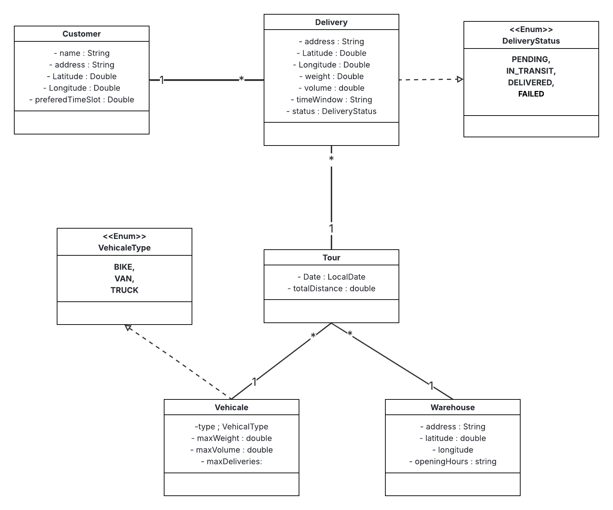

# Wasalliya V2

Wasalliya V2 is a logistics delivery route optimizer built with Spring Boot. This is an evolution of V1, migrating from XML configuration to modern Spring Boot annotations and adding advanced features like AI optimization and database migration management.

## Features

### Advanced Route Optimization

The application provides **three optimization algorithms** using the **Strategy Pattern**:

- **AIOptimizer** (New! Uses Spring AI with Ollama)
  - Leverages AI models (Gemma3:4b) to optimize delivery routes
  - Intelligent route planning with constraint handling
  - JSON-based communication with AI models

- **ClarkeWrightOptimizer**
  - Implements the Clarke and Wright savings algorithm
  - Classic optimization approach for vehicle routing problems

- **NearestNeighborOptimizer**
  - Simple yet effective greedy algorithm
  - Starts from warehouse and selects nearest unvisited delivery

### Dynamic Algorithm Switching (CRITICAL)

The active optimizer can be **dynamically changed** in `application.yml` using the `app.optimizer.strategy` property (thanks to `@ConditionalOnProperty`):

```yaml
app:
  optimizer:
    strategy: ai              # Options: ai | clarkeWright | nearestNeighbor
```

This allows you to switch between algorithms without code changes, making it easy to compare performance and choose the best strategy for your use case.

### Database Migration

The project uses **Liquibase** to manage schema evolution from V1 to V2:

- **Changelog Files:**
  - `db.changelog-master.xml` - Master changelog file
  - `db.changelog-v1.0-initial.xml` - Initial V1 schema
  - `db.changelog-v2.0-new-entities.xml` - V2 new entities (Customer, DeliveryHistory)

### Multi-Environment Profiles (CRITICAL)

The application is configured with **Spring Profiles** for different environments:

- **`dev` profile** - Uses H2 (In-Memory Database)
  - Fast development setup
  - No external database required
  - H2 Console enabled for debugging

- **`qa` profile** - Uses MySQL
  - Production-like environment
  - Persistent data storage
  - MySQL connection required

### New Business Logic

- **New Entities:**
  - **Customer** - Customer information with preferred time slots
  - **DeliveryHistory** - Historical delivery records with timing data

- **Automatic DeliveryHistory Creation:**
  - When a Tour is marked as `COMPLETED`, the system automatically creates `DeliveryHistory` records
  - Tracks delivery date, day of week, planned time, actual time, and delay calculations
  - Provides audit trail for delivery performance analysis

### Advanced Search & Pagination

The API now supports **pagination** (`Pageable`) and **advanced search** (`@Query`, `findBy...`) on main endpoints:

- Paginated endpoints with `page` and `size` parameters
- Search functionality (e.g., customer name filtering)
- Query-based filtering for complex search scenarios

## Technology Stack

- **Java 17**
- **Spring Boot 3.3+**
- **Spring Data JPA** - Data persistence layer
- **Spring AI** - AI integration with Ollama
- **Liquibase** - Database migration tool
- **H2** - In-memory database (for dev)
- **MySQL** - Production database (for qa)
- **Maven** - Build and dependency management
- **Lombok** - Reduces boilerplate code
- **Springdoc OpenAPI (Swagger)** - API documentation
- **JUnit 5 / Mockito / @WebMvcTest** - Testing framework

## Prerequisites

- **JDK 17** or later
- **Maven** 3.2+ (or use the included Maven wrapper `./mvnw`)
- **Ollama** (Required for AI optimization):
  - Install Ollama from [ollama.ai](https://ollama.ai)
  - Pull the required model:
    ```bash
    ollama pull gemma3:4b
    # Or alternative: ollama pull tinyllama
    ```
  - Ensure Ollama is running on `http://localhost:11434`
- **MySQL** (Required for 'qa' profile):
  - A running MySQL server
  - Database will be created automatically if it doesn't exist

## Installation & Running

### 1. Clone the repository

```bash
git clone https://github.com/ChehAchraf/wassal-liya-AI.git
cd wassal-liya-AI
```

### 2. Build the project

```bash
# Using Maven wrapper (recommended)
./mvnw clean install -U

# Note: The -U flag forces update of dependencies, which is needed for milestone/snapshot dependencies
```

### 3. Run the application

**For H2 (Dev Profile):**
```bash
./mvnw spring-boot:run -Dspring.profiles.active=dev
```

**For MySQL (QA Profile):**
```bash
./mvnw spring-boot:run -Dspring.profiles.active=qa
```

The application will start on `http://localhost:8080`.

## Configuration (The Core of V2)

### Switching Database Profile

In `application.yml`, configure the active profile:

```yaml
spring:
  profiles:
    active: dev  # Options: dev | qa
```

### Switching Optimizer Strategy

In `application.yml`, configure the optimizer strategy:

```yaml
app:
  optimizer:
    strategy: ai  # Options: ai | clarkeWright | nearestNeighbor
```

### Profile-Specific Configuration

**`application-dev.yml`** (H2 Configuration):
```yaml
spring:
  datasource:
    url: jdbc:h2:mem:testdb;DB_CLOSE_DELAY=-1
    driver-class-name: org.h2.Driver
    username: sa
    password: ""
  h2:
    console:
      enabled: true
      path: /h2-console
```

**`application-qa.yml`** (MySQL Configuration):
```yaml
spring:
  datasource:
    url: jdbc:mysql://localhost:3306/wasalliya_qa_db?useSSL=false&serverTimezone=UTC&createDatabaseIfNotExist=true
    username: root
    password: your_password
    driver-class-name: com.mysql.cj.jdbc.Driver
```

### Spring AI Configuration

Configure Ollama connection in `application.yml`:

```yaml
spring:
  ai:
    ollama:
      base-url: http://localhost:11434
      chat:
        options:
          model: gemma3:4b
          temperature: 0.7
```

## API Endpoints

### Swagger UI

Once the application is running, access the interactive API documentation at:

**http://localhost:8080/swagger-ui.html**

This interface provides detailed information about all available endpoints and allows you to interact with the API directly from your browser.

### Main Endpoints

#### Route Optimization

- **POST** `/tours/optimize?warehouseId={id}&vehicaleId={id}`
  - Run the optimizer algorithm
  - Returns optimized delivery route with total distance
  - Algorithm used depends on `app.optimizer.strategy` configuration

#### Tour Management

- **GET** `/tours` - Get all tours
- **POST** `/tours` - Create a new tour
- **GET** `/tours/{id}` - Get tour by ID
- **PUT** `/tours/{id}` - Update tour
- **DELETE** `/tours/{id}` - Delete tour
- **POST** `/tours/{id}/completed` - Mark tour as completed (creates DeliveryHistory)

#### Customer Management (New in V2)

- **GET** `/customers?page=0&size=5&name={filter}` - Get paginated customers with optional name filter
- **POST** `/customers` - Create a new customer
- **PUT** `/customers/{id}` - Update customer
- **DELETE** `/customers/{id}` - Delete customer

#### Delivery Management

- **GET** `/deliveries` - Get all deliveries
- **POST** `/deliveries` - Create a new delivery
- **GET** `/deliveries/{id}` - Get delivery by ID
- **PUT** `/deliveries/{id}` - Update delivery
- **DELETE** `/deliveries/{id}` - Delete delivery

#### Vehicle Management

- **GET** `/vehicles` - Get all vehicles
- **POST** `/vehicles` - Create a new vehicle
- **GET** `/vehicles/{id}` - Get vehicle by ID
- **PUT** `/vehicles/{id}` - Update vehicle
- **DELETE** `/vehicles/{id}` - Delete vehicle

#### Warehouse Management

- **GET** `/warehouses` - Get all warehouses
- **POST** `/warehouses` - Create a new warehouse
- **GET** `/warehouses/{id}` - Get warehouse by ID
- **PUT** `/warehouses/{id}` - Update warehouse
- **DELETE** `/warehouses/{id}` - Delete warehouse

## Class Diagram (V2)



## Database Schema Evolution

### V1 → V2 Migration

The project uses Liquibase to manage database schema evolution:

1. **V1 Initial Schema** (`db.changelog-v1.0-initial.xml`):
   - Deliveries
   - Tours
   - Vehicles
   - Warehouses

2. **V2 New Entities** (`db.changelog-v2.0-new-entities.xml`):
   - Customers
   - DeliveryHistory

## Testing

The project includes comprehensive tests using:
- **JUnit 5** - Unit testing framework
- **Mockito** - Mocking framework
- **@WebMvcTest** - Web layer testing

Run tests with:
```bash
./mvnw test
```

## License

This project is licensed under the MIT License - see the `LICENSE` file for details.

---

## Migration Notes (V1 → V2)

### Key Changes

1. **Configuration Migration:**
   - Migrated from XML-based configuration to Spring Boot annotations
   - Added Spring Profiles for multi-environment support

2. **New Features:**
   - AI-powered route optimization
   - Customer management
   - Delivery history tracking
   - Advanced search and pagination

3. **Database Changes:**
   - Added `customers` table
   - Added `delivery_history` table
   - All changes managed through Liquibase changelogs

4. **API Enhancements:**
   - Pagination support on main endpoints
   - Advanced search capabilities
   - New endpoints for customers and delivery history
